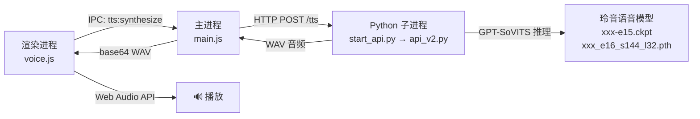

# 🎙️ GPT-SoVITS 玲音语音集成方案

## 架构概览

## 修改/新增的文件

| 文件 | 状态 | 说明 |
|------|------|------|
| [start_api.py](file:///e:/PROJRCT/Desk-assistant/lain-voice-model/start_api.py) | 🆕 新增 | Python 启动脚本，修补 tts_infer.yaml 并启动 api_v2 |
| [tts-server.js](file:///e:/PROJRCT/Desk-assistant/src/main/tts-server.js) | 🆕 新增 | Node.js TTS 服务管理器（启停/健康检查/合成代理） |
| [main.js](file:///e:/PROJRCT/Desk-assistant/src/main/main.js) | ✏️ 修改 | 集成 TTS 生命周期 + IPC handlers |
| [preload.js](file:///e:/PROJRCT/Desk-assistant/src/main/preload.js) | ✏️ 修改 | 暴露 TTS API 给渲染进程 |
| [constants.js](file:///e:/PROJRCT/Desk-assistant/src/shared/constants.js) | ✏️ 修改 | 新增 TTS IPC 通道 |
| [voice.js](file:///e:/PROJRCT/Desk-assistant/src/renderer/scripts/voice.js) | ✏️ 重写 | GPT-SoVITS 优先，浏览器 TTS 兜底 |
| [chat.css](file:///e:/PROJRCT/Desk-assistant/src/renderer/styles/chat.css) | ✏️ 修改 | 新增朗读按钮状态样式 |

## 工作流程

1. **应用启动时**：`main.js` 创建 `TTSServer`，后台异步启动 Python 子进程
2. **Python 子进程**：`start_api.py` 修补 `tts_infer.yaml`（写入 Lain 模型路径），然后启动 `api_v2.py`
3. **模型加载**：服务就绪后通过 HTTP 调用 `/set_sovits_weights` 和 `/set_gpt_weights` 加载训练模型
4. **语音合成**：AI 回复完成 → `voice.js` 通过 IPC 调用 `tts:synthesize` → 主进程 POST 到 `http://127.0.0.1:9880/tts` → 返回 WAV → Web Audio API 播放

## 参考音频配置

| 参考 | 文件 | Prompt Text | Similarity |
|------|------|-------------|------------|
| **rank_005** (默认) | `rank_005_sim_0.993_clip_083_770.9s-774.1s.wav` | 誰も彼もが味方だと思ってしまっただけ | 0.993 |
| rank_049 | `rank_049_sim_0.961_clip_121_928.6s-932.7s.wav` | レインは人なんかじゃなかったんだね | 0.961 |

> [!IMPORTANT]
> 参考音频的 prompt_lang 固定为 `ja`（日语），因为音频内容是日语。合成文本可以是中/日/英/auto。

## UI 反馈

- 🟢 **绿色** 朗读按钮 = 使用浏览器 TTS
- 🩷 **粉色** 朗读按钮 = GPT-SoVITS 玲音语音已连接
- ✨ **脉冲动画** = 正在播放语音

## 启动前提

> [!WARNING]
> 需要确保 Python 环境已安装 GPT-SoVITS 的依赖（torch, fastapi, uvicorn, pyyaml 等）。
> 首次启动模型加载可能需要 30-120 秒（取决于 GPU/CPU）。
